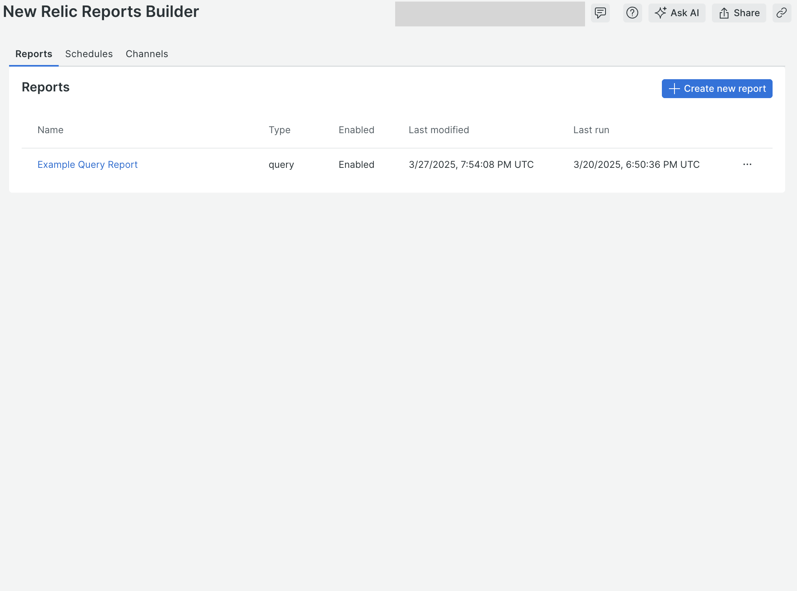
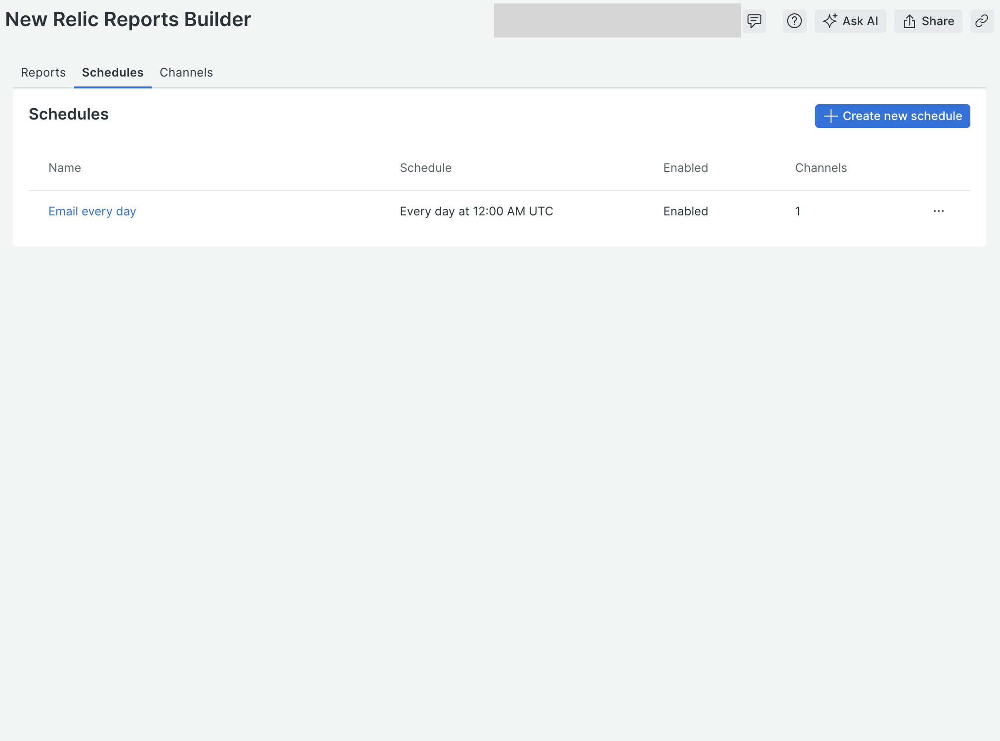
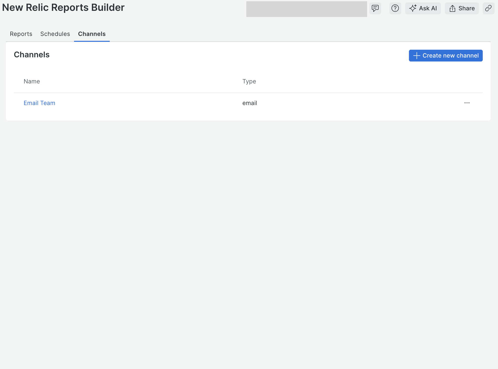
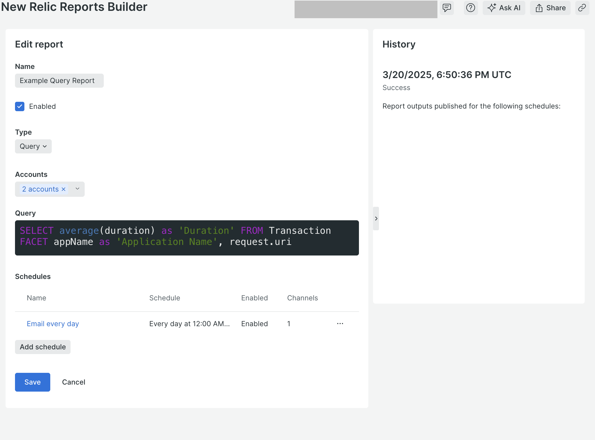
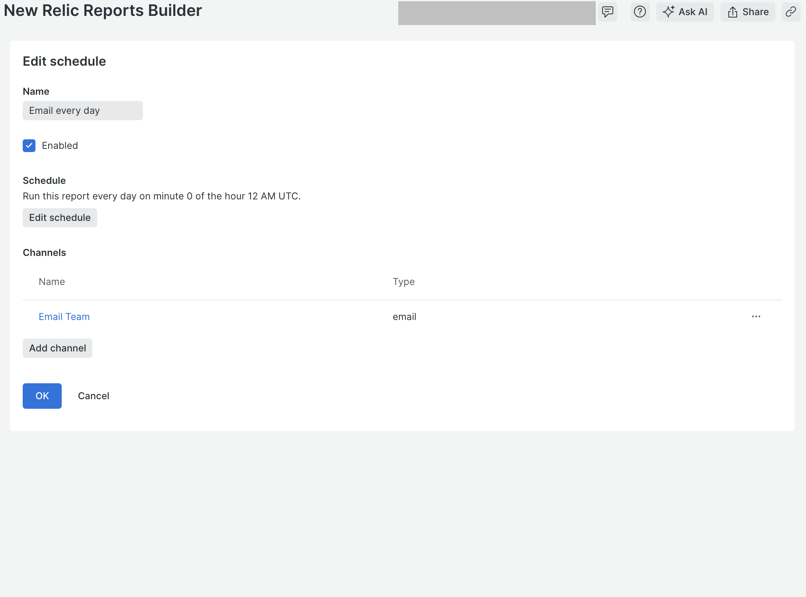
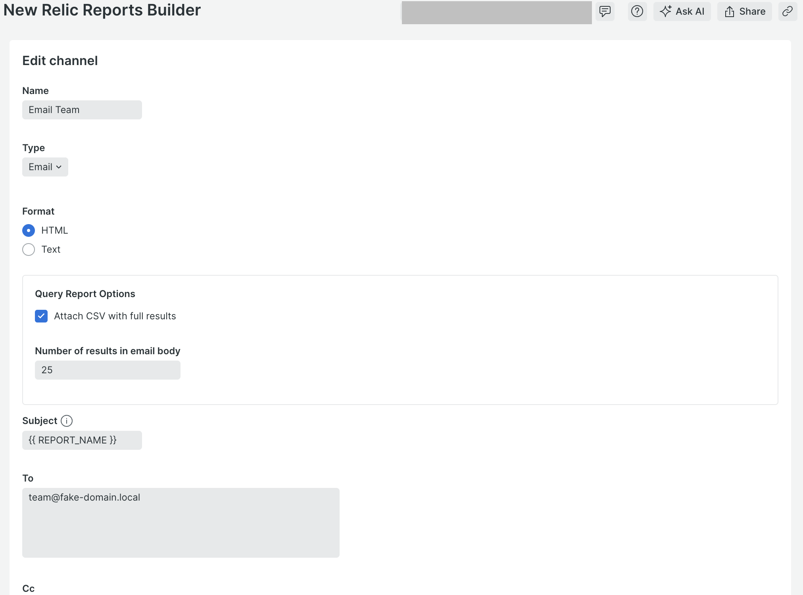
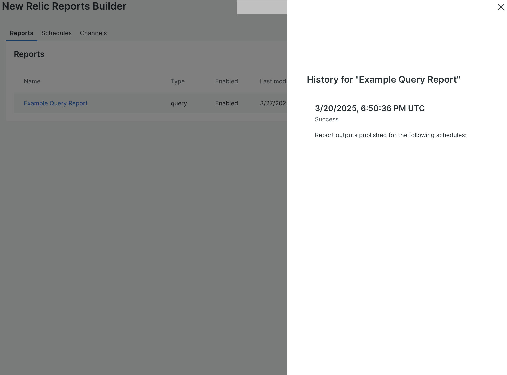
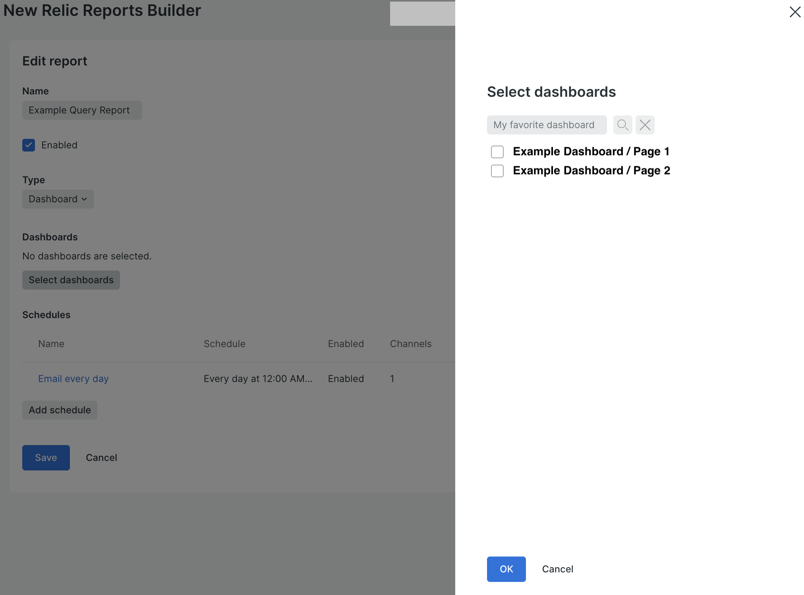
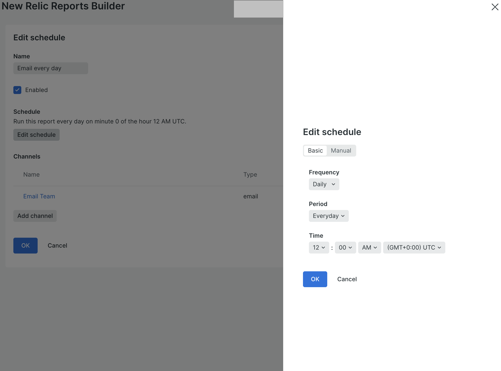

# New Relic Reports Builder

The New Relic Reports Builder is a custom [New Relic application](https://docs.newrelic.com/docs/new-relic-solutions/build-nr-ui/build-nr-app/)
that works together with [New Relic Reports](https://github.com/newrelic/nr-reports)
to provide a full end-to-end scheduled reporting solution. It is built with the
[New Relic SDK components](https://docs.newrelic.com/docs/new-relic-solutions/build-nr-ui/sdk-component/intro-to-sdk/)
to provide a user interface running in the New Relic UI that allows you to
build scheduled reports that can deliver [dashboard](https://github.com/newrelic/nr-reports#dashboard-reports-1)
snapshots or [query](https://github.com/newrelic/nr-reports#query-reports-1)
results via various [channels](https://github.com/newrelic/nr-reports#channels).

## Dependencies

The New Relic Reports Builder _must_ be used in combination with one of the
[New Relic Reports](https://github.com/newrelic/nr-reports) runtimes, either the
New Relic Reports [Java Scheduler](https://github.com/newrelic/nr-reports/tree/main?tab=readme-ov-file#using-the-java-scheduler)
or the [New Relic Reports AWS Stack](https://github.com/newrelic/nr-reports/tree/main?tab=readme-ov-file#using-the-new-relic-reports-aws-stack).

## Enabling this App

This App is available via the New Relic Catalog.

To enable it in your account:

1. Go to `Integrations & Agents > Apps and Visualzations` and search for
   "Reports Builder"
1. Click the `New Relic Reports Builder` card, and then click the `Add this App`
   button to add it to your account(s)
1. Click `Open App` to launch the app (note: on the first time accessing the
   app, you may be prompted to enable it)

Once you have added your accounts, you can also open the app by:

1. Open the `Apps` left-hand navigation menu item (you may need to click on the
   `Add More` ellipsis if it doesn't show up by default)
1. In the `Your Apps` section, locate and click on the
   `New Relic Reports Builder` card to open the app

### Manual Deployment

If you need to customize the app, fork the codebase and follow the instructions
on how to [Customize a Nerdpack](https://docs.newrelic.com/docs/new-relic-solutions/tutorials/customize-nerdpacks/).
If you have a change you feel everyone can benefit from, please submit a PR!

## New Relic Reports Builder and New Relic accounts

The New Relic Reports Builder stores reports, schedules, and channels at the
account scope. This means that the reports, schedules, and channels accessible
in the New Relic Reports Builder are dependent on the account selected in the
top right account picker at any given time. If you do not see the expected
reports, schedules, or channels, check that the desired account is selected in
the top right account picker.

## Reports Builder Home Screen

When the New Relic Reports Builder is launched, the Home screen is displayed.
The Home screen has three tabs: the "Reports" tab, the "Schedules" tab, and the
"Channels" tab. The "Reports" tab displays the [report list](#reports-builder-report-list),
the "Schedules" tab displays the [schedule list](#reports-builder-schedule-list),
and the "Channels" tab displays the [channel list](#reports-builder-channel-list).

## Reports Builder Report List

The report list displays the list of all reports defined for the account
currently selected in the top right account picker. Each item in the report list
shows the following information.

* The report name
* The type of report (["Dashboard"](https://github.com/newrelic/nr-reports#dashboard-reports-1)
  or ["Query"](https://github.com/newrelic/nr-reports#query-reports-1))
* A flag indicating whether or not the report is enabled
* The last date and time the report was modified
* The last date and time the report was run
* A button with the ellipsis icon (`...`) to open the report context menu

From this screen, the following actions are available.

* To create a new report, click on the button labeled ["Create new report"](#reports-builder-edit-report-screen).
* To [edit a report](#reports-builder-edit-report-screen), click on the report name.
* To delete a report, click on the the ellipsis icon (`...`) at the end of the
  row for that report in the report list to open the report context menu and
  then click on "Delete".
* To view the [history list](#reports-builder-report-history-list) for a report,
  click on the the ellipsis icon (`...`) at the end of the row for that report
  in the report list to open the report context menu and then click on
  "View history".

## Reports Builder Schedule List

The schedule list displays the list of all schedules defined for the account
currently selected in the top right account picker. Each schedule has a
schedule field that defines the frequency at which associated reports run and a
list of associated [channels](https://github.com/newrelic/nr-reports#channels)
that define how [report outputs](https://github.com/newrelic/nr-reports#report-output)
will be distributed.

Like reports, schedules are defined at the account level. This allows schedules
to be shared between reports so that different reports can run on the same
schedule and be distributed to the channels associated with that schedule
without the need to redefine the schedule for every report.

Schedules can be created directly from the schedule list using the button in the
top right labeled "Create new schedule" or when defining a report. All new
schedules created while defining a report are automatically saved at the account
level and will appear in the schedule list.

The following information is shown for each schedule in the schedule list.

* The schedule name
* A short human-readable description of the schedule frequency, for example
  "Every day at 12:00 AM UTC"
* A flag indicating whether or not the schedule is enabled
* The number of [channels](https://github.com/newrelic/nr-reports#channels)
  associated with the schedule
* A button with the ellipsis icon (`...`) to open the schedule context menu

To [edit a schedule](#reports-builder-edit-schedule-screen), click on the
schedule name. To remove a schedule, click on the the ellipsis icon (`...`) at
the end of the row for that schedule in the schedule list to open the schedule
context menu and then click on "Delete".

**NOTE:** Deleting a schedule will automatically remove the schedule from all
reports it is associated with. There is no need to manually remove the schedule
from all reports. Likewise, updating a schedule will automatically update the
schedule for all reports it is associated with. Associated reports will
automatically be rescheduled if the frequency in the schedule is changed and
changes to the list of channels associated with the schedule or the settings of
those channels will automatically be picked up on the next scheduled run.

## Reports Builder Channel List

The channel list displays the list of all [channels](https://github.com/newrelic/nr-reports#channels)
defined for the account currently selected in the top right account picker. Each
channel has a type and a set of fields specific to the type.

Like reports and schedules, channels are defined at the account level. This
allows channels to be shared between schedules so that different schedules can
publish to the same channels without the need to redefine the channel for every
schedule.

Similar to schedules, channels can be created directly from the channel list
using the button in the top right labeled "Create new channel" or when defining
a schedule, whether directly or while defining a report. All new channels
created will defining a schedule or report are automatically saved at the
account level and will appear in the channel list.

The following information is shown for each channel in the channel list.

* The channel name
* The channel type
* A button with the ellipsis icon (`...`) to open the channel context menu

To [edit a channel](#reports-builder-edit-channel-screen), click on the
channel name. To remove a channel, click on the the ellipsis icon (`...`) at
the end of the row for that channel in the channel list to open the channel
context menu and then click on "Delete".

**NOTE:** Deleting a channel will automatically remove the channel from all
schedules it is associated with. There is no need to manually remove the channel
from all schedules. Reports associated with schedules that use the channel will
not be published to the channel on subsequent runs. Likewise, updating a channel
will automatically update the channel for all schedules it is associated with.
Reports associated with schedules that use the channel will pick up the changes
to the channel on the next run.

## Reports Builder Edit Report Screen

The Edit Report Screen is used when creating or editing a report. It is accessed
by clicking on a report name from the [report list](#reports-builder-report-list)
and provides the following fields.

* The report name text field

  Use this field to enter the name of the report. There are no restrictions on
  the characters that can be used in the report name and report names do not
  need to be unique.

* The report enabled checkbox

  Use this checkbox to enable or disable an entire report. When disabled, the
  report will not be run at the scheduled time(s).

* The report type menu

  Use this menu to select the type of report to be run. Both [dashboard](https://github.com/newrelic/nr-reports#dashboard-reports-1)
  and [query](https://github.com/newrelic/nr-reports#query-reports-1) reports
  are supported. The type of report selected will determine the fields shown
  below the menu.

* The dashboard table

  When the report type menu is set to ["Dashboard"](https://github.com/newrelic/nr-reports#dashboard-reports-1),
  a table will be displayed that shows the title and GUID for each dashboard
  that will be included in the report.

  The dashboard table provides checkboxes at the beginning of each row as well
  as one in the table header row. These checkboxes can be used to quickly
  remove dashboards from reports without needing to open up the [dashboard picker](#reports-builder-dashboard-picker).
  Simply select the appropriate checkboxes and click the button labeled "Remove"
  that appears in the table header over top of the column label for the "GUID"
  column.

  Additionally, below the table, a button labeled "Select dashboards" is
  provided that opens the [dashboard picker](#reports-builder-dashboard-picker)
  which is used to choose the dashboards that will be included in the report.

* The query account picker and NRQL query fields

  When the report type menu is set to ["Query"](https://github.com/newrelic/nr-reports#query-reports-1),
  the query account picker field and the NRQL query field are displayed.

  The query account picker field is used to select up to 5 accounts to use when
  the query in the NRQL query field is run. When more than one account is
  selected, a [multi-account query](https://github.com/newrelic/nr-reports#multi-account-queries)
  will be run using the [cross account](https://github.com/newrelic/nr-reports#cross-account-queries)
  query mode. To select accounts, click anywhere in the field and use the
  checkboxes to select the desired accounts from the popup menu.

  The NRQL query field is used to enter the NRQL query to run. Note that this
  field does _not_ have the same capabilities as the [query builder](https://docs.newrelic.com/docs/query-your-data/explore-query-data/query-builder/introduction-query-builder/).
  It has some basic syntax highlighting capabilities but does not have features
  such as autocompletion and does not recognize all NRQL query syntax. For this
  reason, it is recommended to develop your query in the [query builder](https://docs.newrelic.com/docs/query-your-data/explore-query-data/query-builder/introduction-query-builder/)
  and copy and paste it into the NRQL query field.

* The schedule table

  The schedule table displays the list of schedules associated with the report.
  For each schedule in the list, the same information is shown as in the
  [schedule list](#reports-builder-schedule-list).

  Below the table, a button labeled "Add schedule" is provided that opens
  the [Edit Schedule Screen](#reports-builder-edit-schedule-screen) which is
  used to create and edit schedules.

  To [edit a schedule](#reports-builder-edit-schedule-screen), click on the
  schedule name. To add a schedule to the report, click on the button labeled
  "Add schedule". To remove a schedule from the report, click on the the
  ellipsis icon (`...`) at the end of the row for that schedule in the schedule
  list to open the schedule context menu and then click on "Delete".

  **NOTE:** When a schedule is removed from the report, it is _not_ removed from
  the account. It is only disassociated with the report. To permanently delete a
  schedule, navigate to the [schedule list](#reports-builder-schedule-list) and
  use the schedule context menu for the schedule.

The Edit Report Screen also displays the report history in a collapsible panel
on the right side of the screen. This panel shows the same information as the
[report history list](#reports-builder-report-history-list).

From this screen, the following actions are available.

* To save the report, including changes to any schedules and channels made
  through the Edit Report Screen, and return to the [report list](#reports-builder-report-list),
  click on the button labeled "Save".
* To discard changes, including changes to any schedules and channels made
  through the Edit Report Screen, and return to the [report list](#reports-builder-report-list),
  click on the button labeled "Cancel".

## Reports Builder Edit Schedule Screen

The Edit Schedule Screen is used when creating or editing a schedule. It is
accessed by clicking on a schedule name from the schedule table when [editing a report](#reports-builder-edit-report-screen)
or by clicking on a schedule name from the [schedule list](#reports-builder-schedule-list).
The Edit Schedule Screen provides the following fields.

* The new schedule mode choice

  This field only appears when adding a new schedule to a report, that is, when
  clicking the "Add schedule" button from the [Edit Report Screen](#reports-builder-edit-report-screen)
  _and_ when there is at least one other schedule defined in the account. Use
  this field to choose between creating a new schedule or using an existing one.

  When "Use an existing schedule" is selected, the only other field that is
  displayed is the schedule selector menu. Otherwise, the remaining fields
  listed below are displayed.

  **NOTE:** When editing a schedule that has already been added to the report by
  clicking on the schedule name from the [Edit Report Screen](#reports-builder-edit-report-screen),
  this field will not be displayed, even if the new schedule was just added and
  the report has not yet been saved.

* The schedule selector menu

  The schedule selector menu is displayed when adding a new schedule to a report
  and the new schedule mode choice is set to "Use an existing schedule". The
  menu displays the list of existing schedules in the account. Use this menu to
  select an existing schedule to add to the report.

* The schedule name text field

  Use this field to enter the name of the schedule. There are no restrictions on
  the characters that can be used in the schedule name and schedule names do not
  need to be unique.

* The schedule enabled checkbox

  Use this checkbox to enable or disable the schedule. When disabled, reports
  associated with the schedule will not be run on the schedule defined in the
  schedule field.

* The schedule field

  The schedule field is used to define the frequency at which reports associated
  with this schedule will run. The schedule field displays a human-readable
  description of the schedule, for example,
  "Run this report every day on minute 0 of the hour 12 AM UTC", and a button
  labeled "Edit schedule" that is used to open the [schedule picker](#reports-builder-schedule-picker).

* The channel table

  The channel table displays the list of [channels](https://github.com/newrelic/nr-reports#channels)
  associated with the schedule. For each channel in the list, the same
  information is shown as in the [channel list](#reports-builder-channel-list).

  Below the table, a button labeled "Add channel" is provided that opens
  the [Edit Channel Screen](#reports-builder-edit-channel-screen) which is used
  to create and edit channels.

  To [edit a channel](#reports-builder-edit-channel-screen), click on the
  channel name. To add a channel to the schedule, click on the button labeled
  "Add channel". To remove a channel from the schedule, click on the the
  ellipsis icon (`...`) at the end of the row for that channel in the channel
  list to open the channel context menu and then click on "Delete".

  **NOTE:** When a channel is removed from the schedule, it is _not_ removed
  from the account. It is only disassociated with the schedule. To permanently
  delete a channel, navigate to the [channel list](#reports-builder-channel-list)
  and use the channel context menu.

From this screen, the following actions are available.

* To save the schedule, including changes to any channels made through the edit
  schedule screen, click on the button labeled "Save" (or "OK" when editing the
  schedule through a report). Control will be returned to the [Edit Report Screen](#reports-builder-edit-report-screen)
  if the schedule was being edited through a report or to the [schedule list](#reports-builder-schedule-list).
* To discard changes, including changes to any channels made through the edit
  schedule screen, click on the button labeled "Cancel". Control will be
  returned to the [Edit Report Screen](#reports-builder-edit-report-screen) if
  the schedule was being edited through a report or to the [schedule list](#reports-builder-schedule-list).

## Reports Builder Edit Channel Screen

The Edit Channel Screen is used when creating or editing a channel. It is
accessed by clicking on a channel name from the channel table when [editing a schedule](#reports-builder-edit-schedule-screen)
or by clicking on a channel name from the [channel list](#reports-builder-channel-list).
The Edit Channel Screen provides the following fields.

* The new channel mode choice

  This field only appears when adding a new channel to a schedule, that is, when
  clicking the "Add channel" button from the [Edit Schedule Screen](#reports-builder-edit-schedule-screen)
  _and_ when there is at least one other channel defined in the account. Use
  this field to choose between creating a new channel or using an existing one.

  When "Use an existing channel" is selected, the only other field that is
  displayed is the channel selector menu. Otherwise, the channel name field,
  the channel type field, and the set of fields particular to the channel type
  are displayed.

  **NOTE:** When editing a channel that has already been added to the schedule
  by clicking on the channel name from the [Edit Schedule Screen](#reports-builder-edit-schedule-screen),
  this field will not be displayed, even if the new channel was just added and
  the schedule has not yet been saved.

* The channel selector menu

  The channel selector menu is displayed when adding a new channel to a schedule
  and the new channel mode choice is set to "Use an existing channel". The
  menu displays the list of existing channels in the account. Use this menu to
  select an existing channel to add to the schedule.

* The channel name text field

  Use this field to enter the name of the channel. There are no restrictions on
  the characters that can be used in the channel name and channel names do not
  need to be unique.

* The channel type menu

  Use this menu to select the channel type from the list of supported channel
  types. The remaining set of fields displayed on the screen are determined by
  the type selected.

  **NOTE:** As of v3.4.0, the only channel type supported by the Reports Builder
  is the [email channel type](https://github.com/newrelic/nr-reports#email-channel).

From this screen, the following actions are available.

* To save the channel, click on the button labeled "Save" (or "OK" when editing
  the channel through a schedule). Control will be returned to the [Edit Schedule Screen](#reports-builder-edit-schedule-screen)
  if the channel was being edited through a schedule or to the [channel list](#reports-builder-channel-list).
* To discard changes, click on the button labeled "Cancel". Control will be
  returned to the [Edit Schedule Screen](#reports-builder-edit-schedule-screen)
  if the channel was being edited through a schedule or to the [channel list](#reports-builder-channel-list).

### Reports Builder email channel type fields

The following fields are displayed on the [Edit Channel Screen](#reports-builder-edit-channel-screen)
when "Email" is selected in the channel type menu.

* The email format choice

  Use the email format choice to select the format of the email message, either
  "HTML" or "Text".

* Attach query report as CSV checkbox

  Use this checkbox to specify that results from query reports that are
  published using this channel should be included in CSV format as a file
  attachment on the email message. This checkbox is checked by default. When
  unchecked, query results from query reports that are published using this
  channel will only be included in HTML format in the body of the email message.

* Maximum number of query results field

  Use this field to indicate the maximum number of results that should be
  included in the HTML table in the body of the email message for query reports
  that are published using this channel.

  **NOTE:** The value of this field does not apply to the number of results
  included in the attached CSV when the "Attach CSV with full results" is option
  is checked. The attached CSV will always include the full result set.

* Email subject field

  Use this field to enter the subject line of the email. This field may contain
  [substitution variables](https://github.com/newrelic/nr-reports#channel-parameter-interpolation)
  which will be replaced with the appropriate value before the message is sent.

* Email "To" field

  Use this field to enter the list of recipients that should receive the email.
  Multiple email addresses can be specified separated by commas.

* Email "Cc" field

  Use this field to enter the list of recipients that should receive a copy of
  the email. Multiple email addresses can be specified separated by commas.

* Email message field

  Use this field to specify the body of the message. This field may contain
  [substitution variables](https://github.com/newrelic/nr-reports#channel-parameter-interpolation)
  which will be replaced with the appropriate value before the message is sent.

## Reports Builder Report History List

The history list for a report shows the 100 most recent runs of the report in
the past month. It is accessible from the report context menu on the [Edit Report Screen](#reports-builder-edit-report-screen).

For each run, the date and time of the run is displayed as well as the status of
the run (whether the run was successful or failed) and the name of the schedule
that triggered the report.

**NOTE:** Despite the wording of the label "Report outputs published for the
following schedules", a run is only ever triggered by a single schedule.

## Reports Builder Dashboard Picker

The dashboard picker is used to select dashboards to include in a [dasboard report](https://github.com/newrelic/nr-reports#dashboard-reports-1).
It is displayed when "Dashboard" is selected in the report type menu on the [Edit Report Screen](#reports-builder-edit-report-screen)
and the "Select dashboards" button is clicked.

The dashboard picker displays a search box at the top followed by a list of
dashboards that match the search filter. By default, the search filter is empty
and all dashboards accessible to the current user are displayed.

Each item in the list actually represents a unique dashboard
[_page_](https://docs.newrelic.com/docs/query-your-data/explore-query-data/dashboards/manage-your-dashboard/#add-pages),
even for single-page dashboards. This is because the New Relic platform does not
support exporting PDF snapshots of multi-page dashboards. The name of the
dashboard in the list has the form `<dashboard-name> / <page-name>` and is
preceded by a checkbox that indicates whether the dashboard will be included
in the report or not.

To search the list of dashboards, enter a search string in the search box and
click on the search icon. To clear the search string, click on the `X` icon.

To save the current selection of dashboards, click the button labeled "OK". The
dashboard table will be updated to reflect the selected dashboards.

To discard changes, click on the button labeled "Cancel".

## Reports Builder Schedule Picker

The schedule picker is used to configure the schedule frequency in a schedule.
It is displayed when "Edit schedule" is clicked on the [Edit Schedule Screen](#reports-builder-edit-schedule-screen).

The schedule picker supports building the schedule frequency in two ways: basic
and manual.

In basic mode, the schedule picker displays the following fields that can be
used to create basic schedule frequencies without the need to understand
[quartz CRON syntax](https://www.quartz-scheduler.org/documentation/quartz-2.3.0/tutorials/crontrigger.html).

* The frequency field

  Use this field to choose between a "Daily", "Weekly", or "Monthly" schedule.

* The period field

  Use this field to further refine the frequency when the frequency selected in
  the frequency field is "Daily" or "Weekly".

  When the frequency field is set to "Daily", the period field can be set to
  "Everyday", "Weekdays" or "Weekends".

  When the frequency field is set to "Weekly", the period field displays a
  checkbox for each day of the week. Use the checkboxes to select the days of
  the week on which to run the schedule.

* The day of week and week of month fields

  The "Day of week" and "Week of month" fields are displayed when the frequency
  field is set to "Monthly". Use these fields to pick a specific day of the week
  and week of the month that the schedule should run, for example, "Sunday" on
  "Week two" of the month.

* The time fields

  The time fields are used to select the hour(s), minute(s), AM/PM, and timezone
  at which to run the schedule.

  The hour field can be set to "Every hour" or a specific hour of the day. When
  "Every hour" is selected the AM/PM menu and the timezone menu are disabled.
  When a specific hour is selected, the AM/PM menu and the timezone menu are
  enabled.

  The minute field can be set to "Every minute" or a specific minute of the
  hour, in five minute increments (00, 05, 10, and so on).

  Use the AM/PM menu when a specific hour of the day is selected to indicate
  whether the selected hour is in the AM or PM.

  Use the timezone menu when a specific hour of the day is selected to indicate
  the timezone in which to interpret the hour.

In manual mode, the schedule picker displays a field that can be used to enter
a six-field CRON expression following [Quartz CRON syntax](https://www.quartz-scheduler.org/documentation/quartz-2.3.0/tutorials/crontrigger.html).
This allows for much more advanced schedule frequencies but requires some
knowledge of the [Quartz CRON syntax](https://www.quartz-scheduler.org/documentation/quartz-2.3.0/tutorials/crontrigger.html).

**NOTE:** Specifying the "Seconds" field is not supported. Instead, the value
`0` will always be used for the "Seconds" field. Specifying the "Year" field is
optional.

To save the current schedule frequency, click the button labeled "OK". The
schedule field will be updated to reflect the new schedule frequency.

To discard changes, click on the button labeled "Cancel".

**NOTE:** If the schedule frequency is built in basic mode, the Reports Builder
will generate human-readable descriptions of the schedule frequency in the UI,
for example, "Run this report every day on minute 0 of the hour 12 AM UTC". If
the schedule frequency is built in manual mode, the Reports Builder will display
a message indicating that the expression is custom followed by the CRON
expression, for example "This report will run as specified by the custom CRON
expression "*/5 * * * ? *"".

